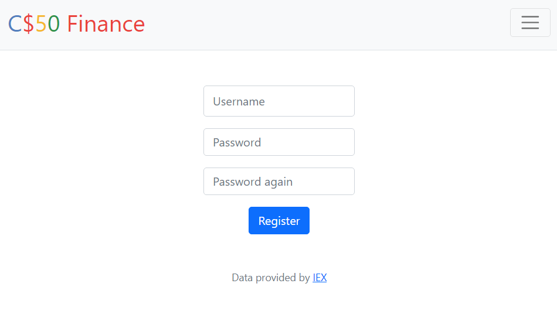
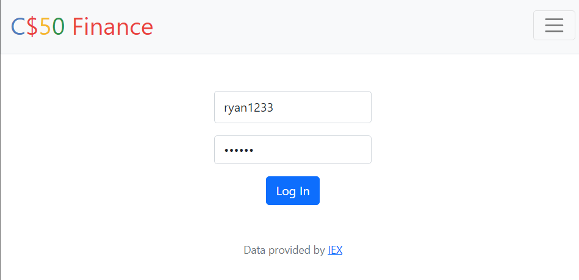
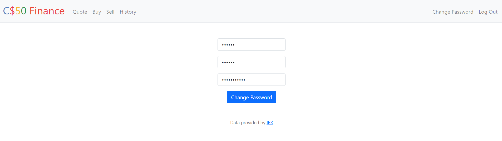
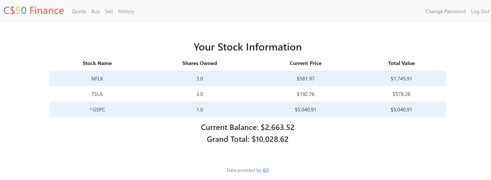
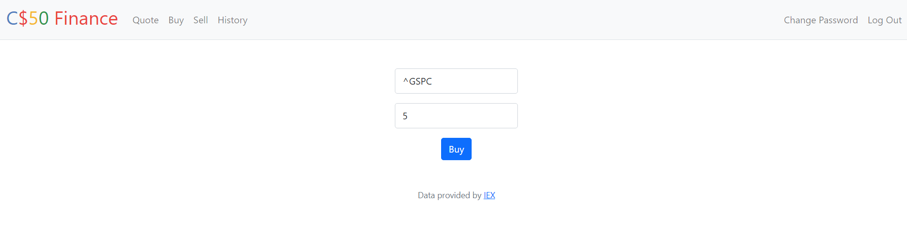
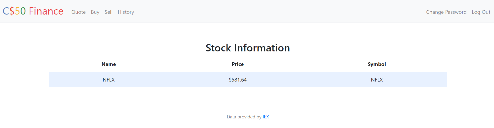
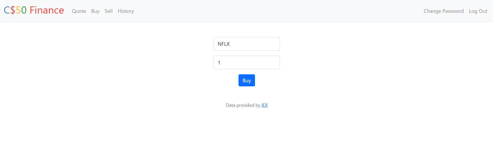
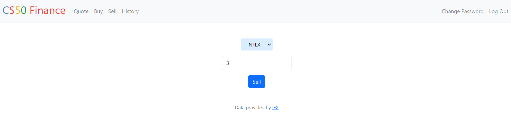
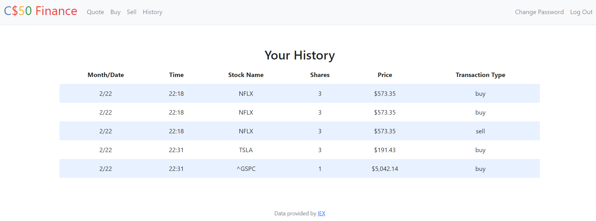

# **Stock Simulation App**

## About This Project
- This app was project made for the CS50x week 8 course.
- This app is a stock simulation app that allows user to check the price of a stock, buy stock, sell stock and check user's history. Sign in, log in and change password options are also included in this app

# UI
1. Register 

2. Login

3. Change Password

4. User's Portfolio

5. Search Stock

6. Buy Stock

7. Sell Stock

8. History
